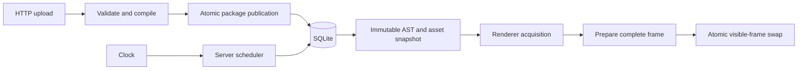

# Glypha Implementation Design

Status: Draft for review. The six behavioral decisions in [DesignDecisions.md](../DesignDecisions.md) are accepted; concrete mechanisms proposed here are design choices, not implemented features.
All repository documentation and source comments are written in English.

The design keeps two components: a Go server and a renderer. SQLite is embedded server storage, not another service. The server publishes immutable content snapshots. The renderer owns its displayed resources and replaces the visible frame only after a complete successful preparation.

| Document | Responsibility |
|---|---|
| [Content and scheduling](content-and-scheduling.md) | Input format, scene semantics, time rules, finite generation, and catch-up |
| [Server and persistence](server-and-persistence.md) | Publication, durable consumption, transactions, concurrency, and restart |
| [HTTP and rendering](http-and-rendering.md) | Uploads, self-contained AST responses, retries, and atomic display replacement |
| [Verification and delivery](verification-and-delivery.md) | Alloy correspondence, implementation checks, and build order |

## Main boundaries

The transaction commits before a new target is returned. The network transfer owns a snapshot independent of subsequent uploads. The visible frame owns its resources independently of both server storage and the next retrieval attempt.

## Scope

One server instance owns one current package for one display profile. Multiple renderer processes may retrieve it, but synchronized playback and per-device schedules are outside the initial design. The server does not track acknowledgments or renderer sessions.

There is no administrative application, content history, rollback interface, event queue service, or push-notification subsystem. Polling drives schedule advancement, so no renderer means no display-driven timer work. A later request catches up.

The initial design intentionally separates the portable renderer state machine from its platform-specific drawing backend. The deployment OS, window system, and concrete graphics library remain platform choices. They must provide the preparation and frame-swap contract before an implementation can claim the display invariants.

## Proposed operational defaults

These values bound initial resource use; they are not product features or additional guarantees.

| Setting | Initial value |
|---|---|
| Poll delay after an attempt | 1 second, measured with a monotonic timer |
| Request timeout | 15 seconds |
| Retry delay after failure | 1, 2, 4, 8, then 15 seconds; reset on success |
| Concurrent uploads | 1; additional uploads receive a retryable busy response |
| Concurrent snapshot transfers | 2; additional transfers receive a retryable busy response |
| Content JSON | At most 1 MiB |
| Entire upload | At most 32 MiB |
| Decoded image pixels per package | At most 32 million in total |
| Scenes / elements per scene | At most 64 / 128 |
| Response envelope | At most 48 MiB including base64 assets |

Pixel buffers, active display resources, staging resources, and bounded concurrent snapshots must all be included in the implementation memory budget. These caps still require a benchmark on the target device.
